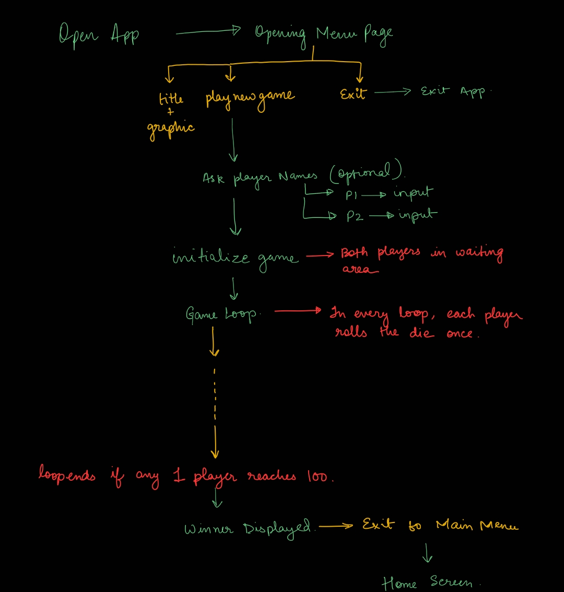

# Advanced Programming final project
###Made by Ambuj Bhaskar Tiwari `2020358` and Aditya Ahuja `2020275`

- The source code is in the `src` directory in the `sample` package.
- You can run the application by running the `main()` method in the `Main` class.
- The `sample.fxml` file defines the structure of the nodes and various elements in the project.
- The logic is handled in the `Controller` class
- Apart from `fxml`, Additional styling is done using the `style.css` file. 
This is the rough Design of the flow of Program
